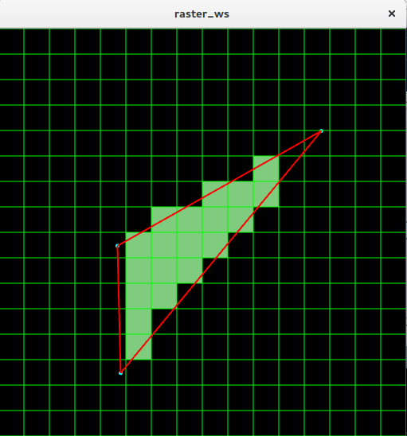
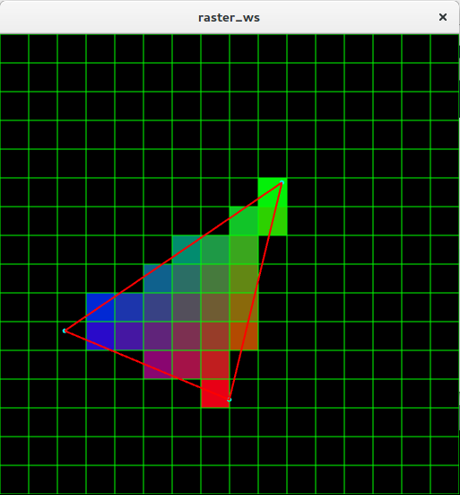
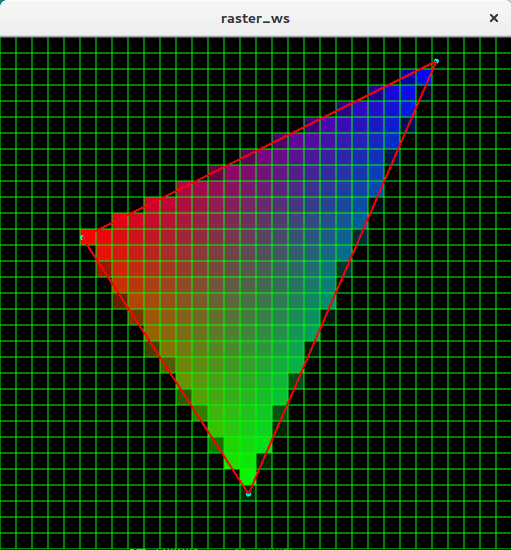

# Taller raster

## Propósito

Comprender algunos aspectos fundamentales del paradigma de rasterización.

## Tareas

Emplee coordenadas baricéntricas para:

1. Rasterizar un triángulo;
2. Implementar un algoritmo de anti-aliasing para sus aristas; y,
3. Hacer shading sobre su superficie.

Implemente la función ```triangleRaster()``` del sketch adjunto para tal efecto, requiere la librería [frames](https://github.com/VisualComputing/framesjs/releases).

## Integrantes

Máximo 3.

Complete la tabla:

| Integrante | github nick |
|------------|-------------|
| Osmar Castillo | oacastillol |
| Christian Vaca | ccvacad     |

## Discusión

Describa los resultados obtenidos. Qué técnicas de anti-aliasing y shading se exploraron? Adjunte las referencias. Discuta las dificultades encontradas.

- Rasterización del triangulo


Inicialmente se realiza la rasterización del triangulo obteniendo el siguiente resultado:<br>
    


- Shading de la superficie


Después de realizar la rasterización del triángulo se aplicó la técnica para shading de coordenadas baricentricas con el cual se obtuvieron los siguientes resultados:<br>
    
    
- Anti-alasing


Por último se aplicó la técnica de anti-alasing, con el siguiente resultado:<br>
    


#### Dificultades
- No tener una información clara de cómo se debe instalar la librería.
- Saber cuál es el punto adecuado para realizar los cálculos.
- Entender como es el funcionamiento de la librería


    
## Referencias
[1] https://www.scratchapixel.com/lessons/3d-basic-rendering/rasterization-practical-implementation/rasterization-stage


[2] https://www.scratchapixel.com/lessons/3d-basic-rendering/rasterization-practical-implementation/rasterization-practical-implementation


[3] https://www.youtube.com/watch?v=mYKEMq5HAs8


## Entrega

* Modo de entrega: [Fork](https://help.github.com/articles/fork-a-repo/) la plantilla en las cuentas de los integrantes (de las que se tomará una al azar).
* Plazo: 1/4/18 a las 24h.

